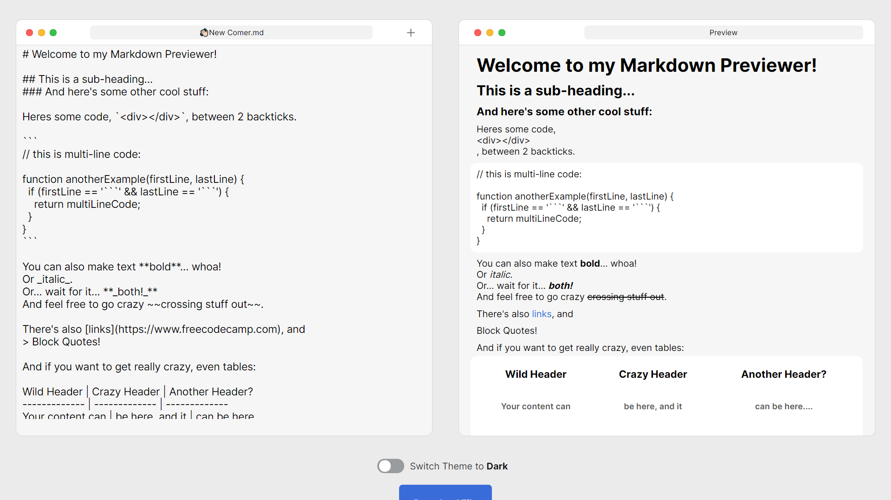

# Markdown-previewer
Write some GitHub flavoured readme code and Get live preview and make your documentation better.

[Website](https://markdown-prev.netlify.app)

# Features
- Fast - Get live preview of the readme code as you type
- Dark Mode - Markdown preview comes with Dark Mode after the release of version v1.0.2
- Download your code - Download the code you wrote in the editor window.
If you want to change the filename of file you want to download change the value of the input in the top bar of the editor window.
By default, The file would download as **👋🏻New Comer .md**
- Add HTML Code - You can add HTML Elements in to a Readme file because it is a an XHTML File.
- The Add Button - The add button provides a solution to add element and other things in to your code.

# License
Markdown previewer is licensed under MIT.
